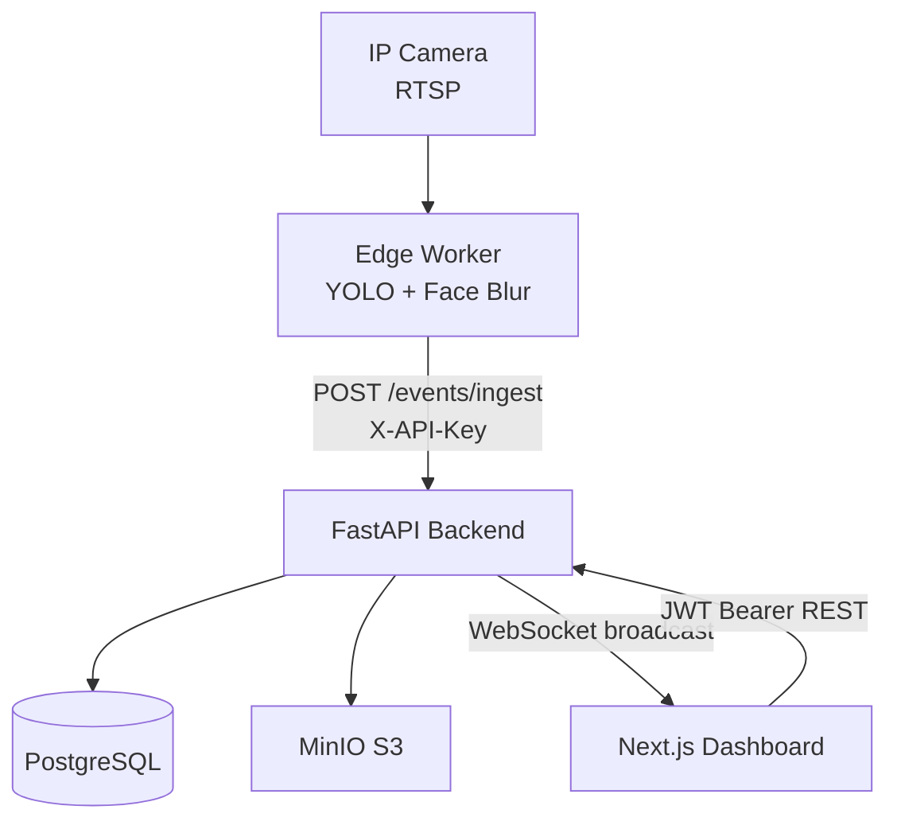
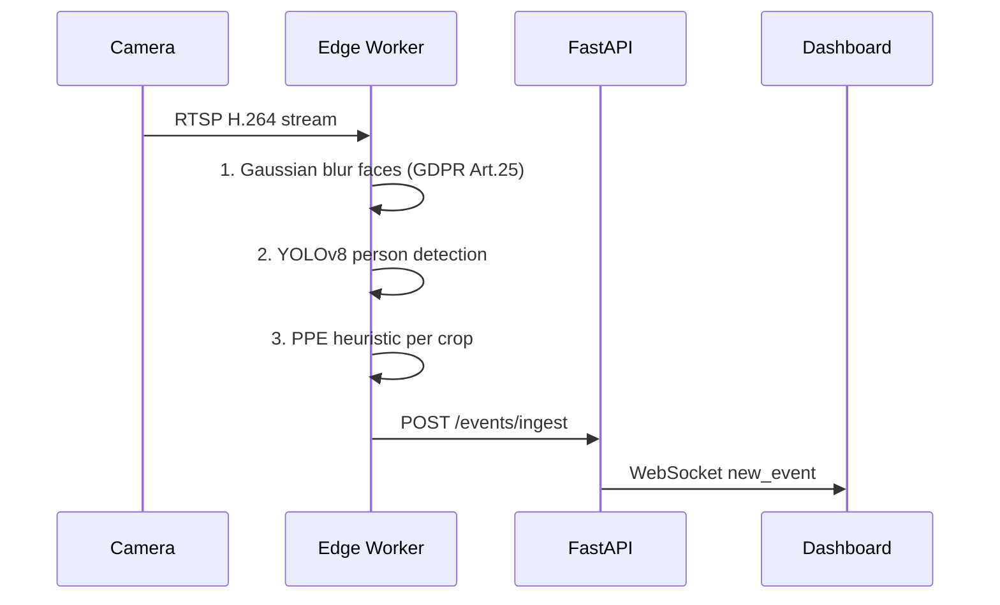

# SäkerSite

> **Bygg säkrare. Skydda din personal.** — *Build safer. Protect your workforce.*

[](https://github.com/gavelinrobert-beep/S-kerSite/actions)
[](LICENSE)

SäkerSite detects missing Personal Protective Equipment (hard hat + high-vis vest) from RTSP camera feeds using YOLOv8, **blurs all faces on the edge device** before any data leaves the site, and streams live alerts to a web dashboard — fully compliant with GDPR, Kamerabevakningslagen, and the EU AI Act.

---

## Architecture





---

## Quickstart

```bash
# 1. Clone
git clone https://github.com/gavelinrobert-beep/S-kerSite.git
cd S-kerSite

# 2. Configure
cp .env.example .env

# 3. Start all services
docker compose -f infra/docker-compose.yml up

# 4. Open app
open http://localhost:3000

# Login with seeded admin:
#   Email:    admin@sakersite.se
#   Password: changeme
```

> ⚠️ **Change all passwords and secrets in `.env` before any production use.**

---

## Project Structure

```
apps/
  edge/          Python worker — RTSP + YOLO + face blur + event emit
  api/           FastAPI backend — REST + WebSocket + JWT + retention
  web/           Next.js 14 frontend — dashboard, alerts, cameras
packages/
  shared-types/  Shared TypeScript type definitions
infra/
  docker-compose.yml
  nginx/nginx.conf
docs/
  architecture.md
  getting-started.md
  compliance/    DPIA, IMY checklist, signage, AI Act, MBL templates
.github/
  workflows/ci.yml
```

---

## Legal & Compliance

> ⚠️ **You MUST complete DPIA + union consultation + (likely) IMY notification before production use.**

### GDPR (Dataskyddsförordningen)

- **Legal basis:** legitimate interest (Art. 6.1.f) — preventing serious workplace injuries
- **DPIA required** (Art. 35) — template: `docs/compliance/DPIA-template.md`
- **Privacy by design:** faces are blurred on the edge device before any data transmission (Art. 25)
- Data minimisation: event metadata only, no raw video stored by default
- 30-day automatic retention with scheduled deletion (configurable)
- Audit log for processing register (Art. 30)

### Kamerabevakningslagen (2018:1200)

- Surveillance notice signs must be posted at all monitored entrances
- Print templates: `docs/compliance/signage-sv.md` / `signage-en.md`
- Full IMY pre-deployment checklist: `docs/compliance/IMY-checklist.md`

### EU AI Act (Regulation 2024/1689)

- Likely classified as **high-risk AI** (Annex III — workplace safety)
- **Prohibited practices (in force Feb 2025) — this system does NOT perform:**
  - ❌ Emotion recognition
  - ❌ Biometric identification of individuals
  - ❌ Social scoring
- Full notes: `docs/compliance/ai-act-notes.md`
- Human oversight: all alerts require manual acknowledgement

### MBL (Medbestämmandelagen)

- **§ 11 primary negotiation** with unions required before deployment
- **§ 19 information obligation** — keep unions informed
- Template: `docs/compliance/union-consultation-template.md`

---

## Roadmap

- [ ] Fine-tuned YOLOv8 PPE model (replace colour heuristics)
- [ ] Video clip storage + presigned URL viewer
- [ ] Multi-site / multi-tenant support
- [ ] Push notifications (email / SMS)
- [ ] Analytics dashboard with trend charts
- [ ] Swedish BankID / SAML SSO
- [ ] Mobile app for safety managers

---

## Development

See [docs/getting-started.md](docs/getting-started.md) for full instructions.

```bash
# API tests
cd apps/api && pytest -v

# Edge tests
cd apps/edge && pytest -v

# Web build
cd apps/web && npm run build
```

---

## License

MIT — see [LICENSE](LICENSE)

> This software is provided for educational and demonstration purposes.
> Production deployment requires completion of all legal and compliance steps above.
> The authors accept no liability for regulatory non-compliance.
