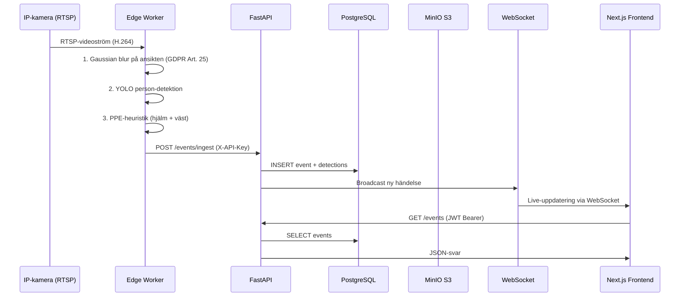
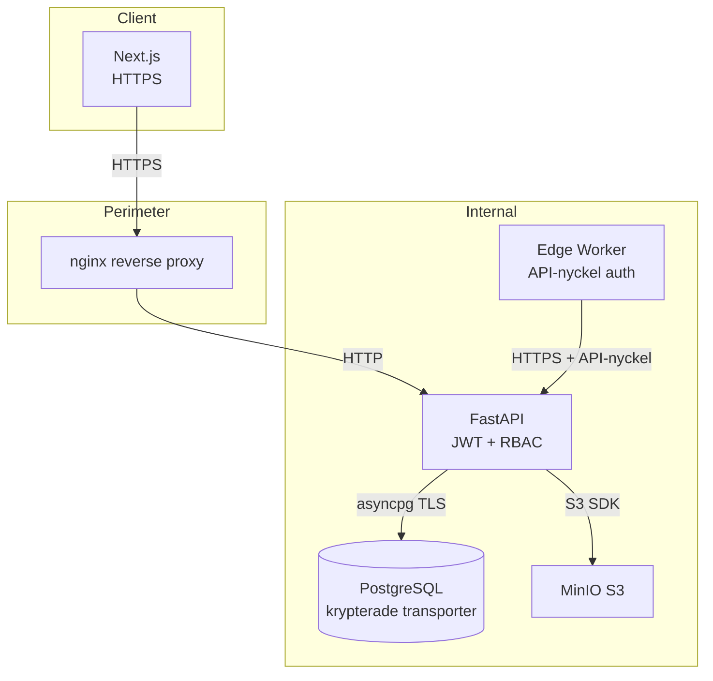

# SäkerSite — Arkitektur

## Systemöversikt

SäkerSite är en monorepo med tre applikationer och ett delat typpaket:

```
apps/
  edge/     Python edge-worker (kameraingång, AI-detektion, face blur)
  api/      FastAPI backend (REST + WebSocket + schemalagda jobb)
  web/      Next.js 14 frontend (App Router, Tailwind, React Query)
packages/
  shared-types/  Delade TypeScript-typer
infra/
  docker-compose.yml
  nginx/
```

---

## Dataflöde



---

## Komponentbeskrivning

### Edge Worker (`apps/edge`)

- **Syfte:** Kör nära kameran (på byggarbetsplatsen)
- **Steg:**
  1. Öppnar RTSP-ström med OpenCV
  2. Kör Gaussian blur på ansikten (face_blur.py) — **privacygaranti**
  3. Kör YOLOv8 person-detektion på suddad bild
  4. Tillämpar PPE-heuristik (color-based) per person-crop
  5. POSTar event till API via HTTP med edge API-nyckel
- **Mock-läge:** Genererar syntetiska events utan kamera (för demo/test)
- **TODO:** Ersätt color-heuristik med fintunad YOLO PPE-modell

### API Backend (`apps/api`)

- **Framework:** FastAPI (Python 3.11)
- **Databas:** PostgreSQL 16 via SQLAlchemy async
- **Autentisering:** JWT (access 30 min + refresh 7 dagar)
- **Lagring:** MinIO (S3-kompatibel) för framtida klipp
- **WebSocket:** Broadcastar nya händelser i realtid
- **Scheduler:** APScheduler — kör retention cleanup var 24h
- **Seed:** Skapar admin-användare och demo-data vid start

### Web Frontend (`apps/web`)

- **Framework:** Next.js 14 (App Router)
- **Styling:** Tailwind CSS
- **State:** Zustand (autentisering), React Query (serverdata)
- **WebSocket:** Ansluter till `/ws/alerts` för live-uppdateringar
- **Sidor:**
  - `/login` — Inloggningssida
  - `/dashboard` — Livefeed + statistik
  - `/events` — Händelselista med filter
  - `/events/[id]` — Händelsedetaljer
  - `/cameras` — Kamerahantering (CRUD)
  - `/compliance` — Revisionslogg

---

## Säkerhetsarkitektur



### Säkerhetsåtgärder

| Lager | Åtgärd |
|---|---|
| Transport | HTTPS/TLS överallt |
| API auth | JWT (Bearer) för användare |
| Edge auth | X-API-Key header |
| RBAC | admin, safety_manager, supervisor, viewer |
| Data | Ansiktsoskärpa på edge |
| Lagring | 30-dagars auto-radering |
| Loggning | Revisionslogg för alla dataaccesser |

---

## Databasschema (förenklat)

```
users
  id (UUID PK)
  email (unique)
  hashed_password
  role (admin|safety_manager|supervisor|viewer)
  is_active

cameras
  id (UUID PK)
  name
  location
  rtsp_url
  is_active

events
  id (UUID PK)
  camera_id (FK cameras)
  event_type (missing_hardhat, missing_vest, ...)
  severity (low|medium|high|critical)
  status (new|acknowledged|resolved|false_positive)
  started_at
  metadata (JSONB)

event_detections
  id (UUID PK)
  event_id (FK events)
  person_id
  bbox (JSONB)
  hardhat_detected (bool)
  vest_detected (bool)
  confidence (float)

audit_log
  id (UUID PK)
  user_id (FK users, nullable)
  action
  resource_type
  resource_id
  ip_address
  created_at
```

---

## Driftsättningstopologi

### Lokal utveckling (Docker Compose)

```
localhost:80    → nginx (reverse proxy)
localhost:3000  → Next.js web
localhost:8000  → FastAPI
localhost:5432  → PostgreSQL
localhost:9000  → MinIO API
localhost:9001  → MinIO Console
```

### Produktionsrekommendation

- Edge worker: NVIDIA Jetson Orin eller x86_64 GPU-maskin nära kameran
- API + Web: Kubernetes eller Docker Swarm på privat molntjänst inom EU (GDPR)
- Databas: Managed PostgreSQL (t.ex. Aiven, Azure Database for PostgreSQL)
- S3: MinIO self-hosted eller EU-lokaliserad S3-kompatibel tjänst
- **Lagra aldrig data utanför EU/EES utan adekvat skyddsnivå**
